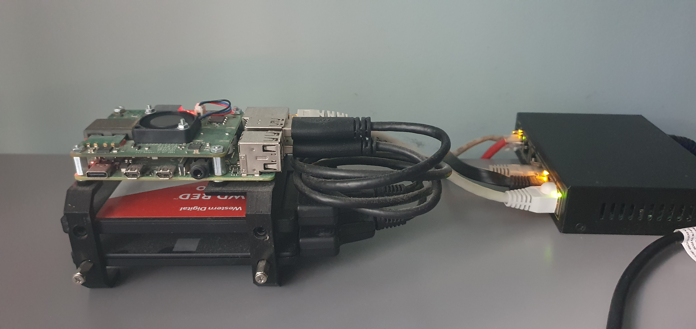

# Local inftarstructure built on raspbery pi.

HDD case 3D=printed from https://www.thingiverse.com/thing:3850735

Infrastructure include:
- samba server
- tools

### Base config 
Should run against every raspberry pi module within infrastructure  
https://github.com/przemekgorzynski/pi_infra/blob/master/docs/base_config.md

### Samba
Should run against raspberry pi module decidated for samba server  
https://github.com/przemekgorzynski/pi_infra/blob/master/docs/samba.md

### Tooling
Stacks are docker-compose based and deployed using ansible playbooks.
Following tools are included:
- Traefik as reverse proxy  
https://github.com/przemekgorzynski/pi_infra/blob/master/docs/traefik.md  
- monitoring stack - prometheus and grafana  
https://github.com/przemekgorzynski/pi_infra/blob/master/docs/monitoring.md  
- Nextcloud instance  
https://github.com/przemekgorzynski/pi_infra/blob/master/docs/nextcloud.md  
- Plex  
https://github.com/przemekgorzynski/pi_infra/blob/master/docs/plex.md  
- Jenkins 
https://github.com/przemekgorzynski/pi_infra/blob/master/docs/jenkins.md  
